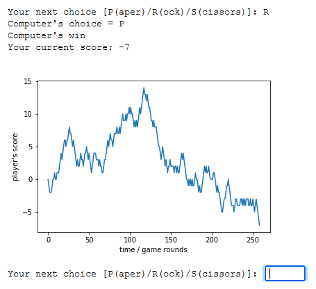

# Projekt Papier-Kamień-Nożyce

## Program uczący się gry “papier, kamień, nożyce”. Jako algorytm uczący zastosowany został łańcuch Markowa z macierzą przejść pomiędzy trzema stanami (Papier, Kamień, Nożyce). Nauka gry polega na korekcie macierzy przejść (prawdopodobieństwa warunkowe zmiany stanu).

## Zasady gry
- ### Papier > Kamień > Nożyce
- ### Wartość "wypłaty" punktowej dla gracza:
    - #### 1 w przypadku wygranej
    - #### −1 w przypadku przegranej
    - #### 0 w przypadku remisu
- ### Sterowanie:
    - #### P - papier (ang. paper)
    - #### R - kamień (ang. rock)
    - #### S - nożyce (ang. scissors)
    - #### exit - zakończenie gry

## Przykładowy przebieg stanu rozgrywki
## przy przeprowadzeniu ciągu ~250 gier

